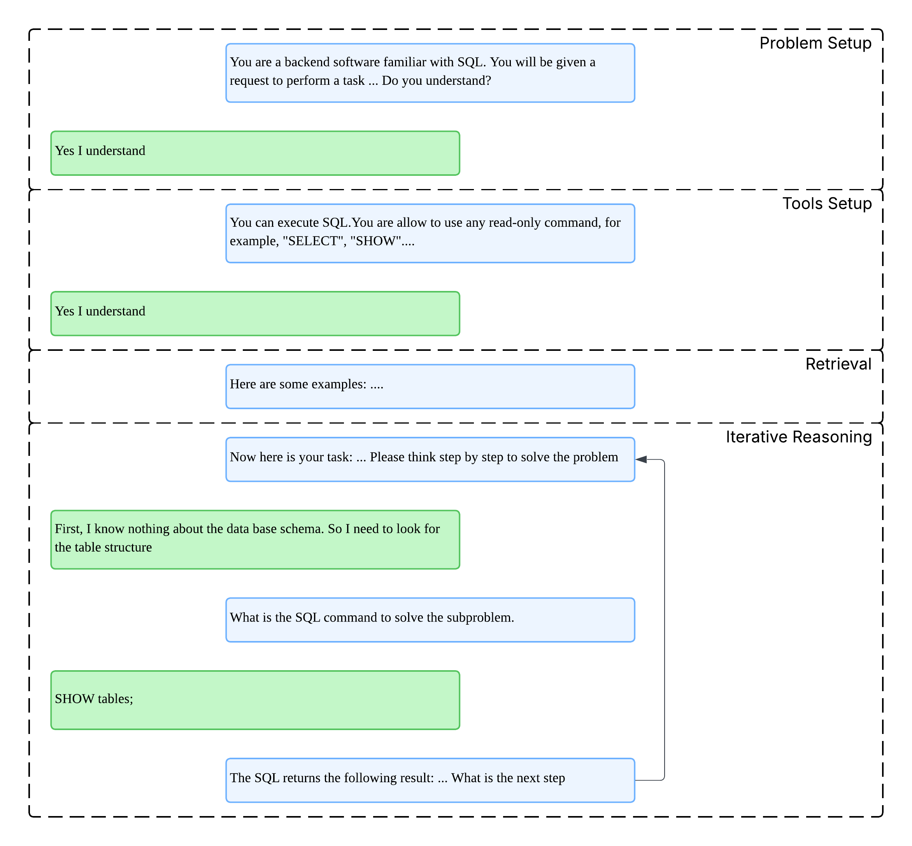

# COMP7404-project

## Environment Setup

This project requires Python 3.11 or higher. It is recommended to use a virtual environment to manage dependencies.

To set up the environment, follow these steps:

```
pip install -r requirements.txt
```

## Generation Pipeline

User input natural language input will be processed using the following steps:

1. Tool introduction and problem setting: Introduce what tools can be used and the propose of the task
2. Retrieve the relevant problem: few-shot prompting
3. Iterative reasoning:
   1. CoT Generation
   2. SQL Generation
   3. SQL Execution
   4. Result Display
   5. Next iteration
  
Here is an example:



## Usage

Before running the application, you may need to get an api key from [Aliyun](https://bailian.console.aliyun.com/#/home) and set it in the environment variable `API_KEY`.

You may change the `config.yaml` to support your own database. and at the same changing the way our application connects to the database. You can also switch mode by changing `type` in `config.yaml` to `math` or `sql`.

To run the application, execute the following command:

```
export API_KEY=<your_api_key_here>
python src/chat_ui.py
```

The application will start a Gradio interface, which you can access in your web browser at `http://localhost:7860`.

Please ensure no other services are running on port 7860.